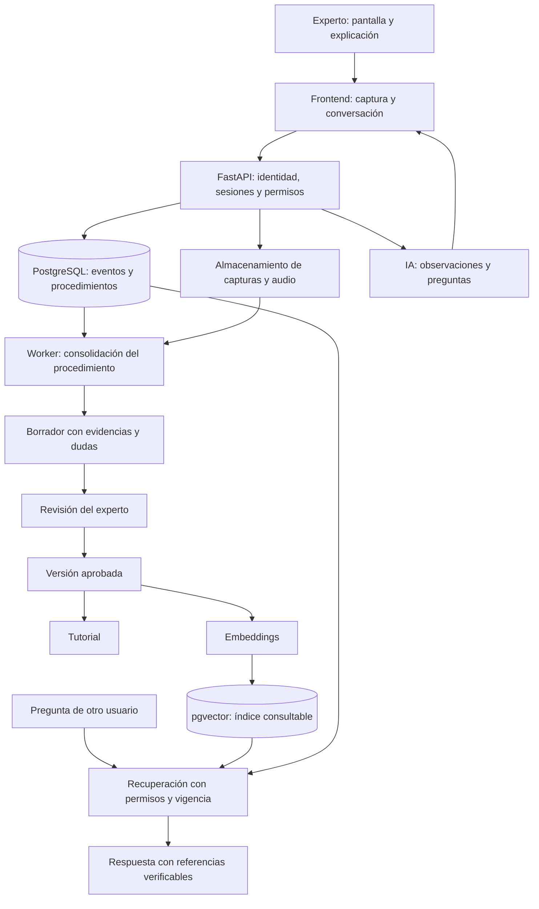

# Cognitive OS: arquitectura y primer producto

Fecha de revisión: 12 de septiembre de 2026.

Este documento propone la base del producto a partir del repositorio existente. Las capacidades y endpoints descritos como propuesta todavía no están implementados. El alcance inicial sugerido es un flujo de cotización en una aplicación, con un experto que enseña y otro usuario que consulta.

## 1. Producto y significado de aprender

Cognitive OS captura cómo una persona realiza un proceso, pregunta por las decisiones que no quedan claras, produce un procedimiento verificable y lo convierte en un tutorial y una fuente para un asistente de consulta.

El aprendizaje persistente consiste en guardar conocimiento externo: evidencias, explicaciones, reglas y versiones aprobadas. Conversar con el modelo no actualiza automáticamente sus pesos. Para este producto propongo recuperación aumentada por generación (RAG): buscar información autorizada y proporcionársela al modelo al responder.

Una grabación demuestra lo sucedido en una ocasión. No demuestra por sí sola que sea el procedimiento correcto para todos los casos. La aplicación debe distinguir lo observado, lo explicado por el experto y lo inferido por la IA.

Ejemplo ilustrativo: ante una pantalla que indica «pendiente de aprobación», la IA pregunta quién aprueba, cuándo se requiere y qué sucede si se rechaza. La respuesta queda asociada al paso y a su evidencia. Las reglas del ejemplo deben confirmarse con el negocio.

## 2. Base encontrada

| Elemento | Estado observado |
| --- | --- |
| API | FastAPI y factoría `create_app` en `src/cognitive_os/main.py` |
| Configuración | `pydantic-settings` y logging en `src/cognitive_os/core/` |
| Endpoint | `GET /api/v1/health` |
| Organización del código | Carpetas `api`, `schemas`, `domain`, `application` e `infrastructure` |
| Pruebas | Dos pruebas de configuración y health en `tests/` |
| Empaquetado | `pyproject.toml`, Python 3.12 y Dockerfile |
| Pendiente | Frontend, persistencia, migraciones, identidad, permisos, captura, integración de IA y RAG |

La organización actual permite crecer manteniendo un backend modular. Propongo implementar los casos de uso en `application`, sus entidades y contratos en `domain`, y los adaptadores de base de datos, archivos y modelos en `infrastructure`.

La comprobación del entorno detectó que `.venv` apunta a un Python 3.12 ausente y que faltan dependencias para ejecutar las pruebas. No se verificó que estas pasaran. También hay archivos de `.venv` y `.idea` en el índice de Git pese a `.gitignore`; conviene corregir ese índice antes de un commit de implementación. Esta revisión no modifica ese estado.

## 3. Arquitectura propuesta

Usar un monolito modular y un worker separado que comparta el código de casos de uso. Los trabajos duraderos pueden comenzar en PostgreSQL con bloqueo, vencimiento de reservas y reintentos; agregar una cola dedicada cuando la concurrencia lo justifique. No hace falta adoptar microservicios o un framework de agentes para validar el producto.

| Componente | Propuesta y función |
| --- | --- |
| Frontend | Aplicación web en TypeScript para compartir pantalla, conversar, revisar pasos y consultar tutoriales |
| Backend | Mantener FastAPI; aplicar permisos, validar entradas y coordinar sesiones |
| Persistencia | PostgreSQL; SQLAlchemy para acceso y Alembic para migraciones |
| Evidencias | Almacenamiento de objetos compatible con S3; en desarrollo, un adaptador de archivos local |
| Procesamiento | Worker para consolidar, generar tutoriales e indexar sin bloquear solicitudes HTTP |
| Visión y extracción | Adaptador configurable a la API de OpenAI |
| Recuperación | Texto original y metadatos en PostgreSQL; vectores en pgvector |

SQLAlchemy ofrece acceso SQL y ORM; Alembic administra cambios de esquema. Son propuestas para esta base Python. [SQLAlchemy](https://docs.sqlalchemy.org/en/20/intro.html), [Alembic](https://alembic.sqlalchemy.org/en/latest/).

## 4. Capturar pantalla y conversar

La primera experiencia puede funcionar desde un navegador: el usuario elige compartir una pestaña, ventana o pantalla mediante `getDisplayMedia()`. Requiere una acción del usuario y permiso en cada inicio; para el despliegue se necesita un contexto seguro. El soporte de audio del sistema varía según navegador y superficie. [Captura de pantalla en MDN](https://developer.mozilla.org/en-US/docs/Web/API/MediaDevices/getDisplayMedia).

Propuesta de captura:

1. Iniciar una sesión con objetivo, aplicación, experto y alcance; mostrar claramente cuándo se captura.
2. Enviar capturas seleccionadas por el usuario y, después, por cambios visuales relevantes. Mantener una captura manual para estados fugaces. Ajustar frecuencia y resolución con mediciones de legibilidad, costo y latencia.
3. Registrar cada evento con identificador, orden, tiempo relativo a la sesión y hora de recepción. Asociar mensajes y segmentos de transcripción a sus capturas.
4. Pedir aclaraciones cuando falta una razón, una condición o un resultado. Ofrecer pausa, corrección y cierre.
5. Consolidar al final pasos, decisiones, excepciones y dudas. Pedir al experto que revise el borrador.

La captura visual no proporciona automáticamente un registro de clics ni acceso al contenido interno de otra aplicación. La observación inicial es posible para ventanas de escritorio compartidas; si después se necesita capturar acciones exactas, evaluar una extensión o un cliente de escritorio con permisos específicos.

La primera iteración propuesta usa texto y capturas para verificar la fidelidad del proceso. La voz en directo forma parte de la evolución prevista. Cuando se incorpore, sincronizarla con la misma línea temporal y mantener el borrador persistido en el backend.

## 5. Modelos y responsabilidades

Para integrar la plataforma se usan identificadores de modelos de la API de OpenAI. La selección siguiente conserva la familia GPT-5.6 solicitada.

| Trabajo | Modelo inicial propuesto | Capacidad verificada |
| --- | --- | --- |
| Comprender capturas, producir pasos y responder con contexto | `gpt-5.6-sol` | Texto e imágenes de entrada, texto de salida y salidas estructuradas; sin audio o video nativos |
| Conversación por voz en una iteración posterior | `gpt-realtime-2.1` | Audio de entrada/salida e imágenes de entrada; sin video nativo |
| Representar texto para búsqueda | `text-embedding-3-small` | Embeddings de texto; 1536 dimensiones por defecto |

El alias `gpt-5.6` apunta a GPT-5.6 Sol. Mantener modelos y versiones de prompts configurables y registrar cuáles generaron cada borrador. Las capacidades publicadas no confirman el acceso de una cuenta concreta ni su latencia en este flujo. [GPT-5.6 Sol](https://developers.openai.com/api/docs/models/gpt-5.6-sol), [GPT-Realtime-2.1](https://developers.openai.com/api/docs/models/gpt-realtime-2.1), [Embeddings](https://developers.openai.com/api/docs/guides/embeddings).

Para voz desde el navegador, Realtime permite WebRTC con credenciales efímeras emitidas por el backend. La clave permanente permanece en el servidor. El backend ejecuta y valida las herramientas que modifican datos. [Guía WebRTC](https://developers.openai.com/api/docs/guides/voice-webrtc).

Enviar imágenes seleccionadas al modelo constituye el análisis de pantalla propuesto; no equivale a enviarle una pista de video continua. Validar cualquier resultado estructurado con Pydantic y reglas del dominio: tener JSON válido no garantiza que el procedimiento sea correcto.

## 6. Base vectorial y RAG

Un embedding representa un fragmento de texto mediante números para buscar similitudes de significado. Permite relacionar una pregunta como «¿qué hago si no aprueban?» con una sección sobre rechazos. En esta propuesta se generan embeddings del procedimiento validado y de descripciones textuales de sus evidencias; las imágenes originales siguen siendo archivos vinculados. [Modelo de embeddings](https://developers.openai.com/api/docs/models/text-embedding-3-small).

Recomiendo PostgreSQL con pgvector para comenzar, porque permite guardar vectores junto a las entidades y relaciones del producto. pgvector ofrece búsqueda exacta y aproximada e índices HNSW/IVFFlat. Incorporar un índice aproximado cuando las mediciones lo requieran; comprobar recuperación y latencia con los filtros reales de organización. [pgvector](https://github.com/pgvector/pgvector).

| Opción | Cuándo considerarla en este proyecto |
| --- | --- |
| PostgreSQL + pgvector | Primera opción: una base para procedimientos, versiones, permisos e índice vectorial |
| Qdrant | Si las mediciones justifican escalar y operar la búsqueda como servicio independiente; seguiría haciendo falta persistencia relacional |
| Vector stores administrados de OpenAI | Alternativa para acelerar un prototipo documental, delegando parte de la indexación al proveedor |

Qdrant documenta filtrado por metadatos y alternativas de escalado; OpenAI ofrece recuperación semántica sobre sus vector stores. Estas son alternativas, no componentes que haya que instalar juntos. [Qdrant](https://qdrant.tech/documentation/overview/), [OpenAI Retrieval](https://developers.openai.com/api/docs/guides/retrieval).

Flujo RAG propuesto:

1. Dividir la versión aprobada por pasos y reglas, conservando contexto del proceso y referencias a evidencias.
2. Guardar texto, embedding, modelo de embedding, organización, versión y estado de indexación. Si cambia el modelo de embeddings, reconstruir el índice correspondiente; no mezclar espacios vectoriales.
3. Determinar en el servidor qué documentos puede consultar el usuario y cuáles están publicados y vigentes.
4. Combinar similitud vectorial con búsqueda textual para recuperar también códigos y nombres exactos. PostgreSQL incluye búsqueda de texto completo. [Búsqueda textual](https://www.postgresql.org/docs/current/textsearch-intro.html).
5. Entregar al modelo únicamente contexto autorizado; devolver referencias a procedimiento, versión, paso y evidencia. Comprobar los identificadores de las citas antes de entregarlos.
6. Cuando falte evidencia o haya versiones contradictorias, explicarlo y pedir contexto. Una alta similitud vectorial no prueba que una respuesta sea correcta.

## 7. Datos y ciclo de publicación

| Entidad propuesta | Información principal |
| --- | --- |
| `Organization`, `Membership` | Organización, usuario y rol: autor, revisor o lector |
| `LearningSession` | Objetivo, aplicación, autor, estado, consentimiento y tiempos |
| `SessionEvent` | Tipo, secuencia, tiempo, mensaje o referencia a evidencia |
| `Evidence` | Archivo, hash, tipo, origen, controles de acceso y retención |
| `Procedure` | Identidad estable del proceso, propietario y alcance |
| `ProcedureVersion` | Versión, estado editorial, vigencia, revisor y fechas |
| `Step`, `Decision`, `StepEvidence` | Acción, condiciones, resultado esperado, ramas, orden y fuentes |
| `Clarification` | Pregunta, respuesta, alcance de la corrección y resolución |
| `KnowledgeChunk` | Texto, embedding, versión y referencias a pasos |
| `Tutorial` | Contenido derivado y versión del procedimiento utilizada |
| `Job`, `AuditEvent` | Trabajo durable, reintentos y registro de cambios |

Cada paso conserva su origen (`observed`, `user_explained` o `inferred`), evidencia y estado de validación. Una puntuación del modelo no sustituye la revisión. Las inferencias necesarias para ejecutar el proceso deben resolverse antes de publicar; las excepciones no enseñadas deben quedar fuera del alcance declarado.

La sesión pasa por `capturing → processing → completed`, con estados de error recuperable. El procedimiento tiene su propio ciclo: `draft → in_review → approved → published → retired`.

La aprobación fija una versión. El worker prepara tutorial e índice; solo al terminar se cambia de forma atómica la versión publicada. Mientras una nueva versión se prepara, continúa vigente la anterior. Una corrección crea otra versión. El chat, el tutorial y sus citas siempre indican la versión usada.

Las autorizaciones deben cubrir consultas SQL, recuperación, cachés y descarga de archivos. Derivar la organización de la identidad autenticada; no confiar en un `organization_id` proporcionado libremente por el cliente. Las instrucciones que aparezcan dentro de capturas o documentos se tratan como contenido, no como órdenes para el asistente.

Permitir pausa, selección de la superficie y ocultamiento de datos sensibles antes del envío. Acordar retención y eliminación de capturas, audio y derivados; una eliminación debe retirar también contenido de búsqueda y tratar las referencias históricas conforme a esa política.

## 8. Orden de implementación

| Incremento | Entrega verificable |
| --- | --- |
| 0. Base reproducible | Reparar el entorno Python, ejecutar las pruebas actuales y corregir el índice de Git |
| 1. Persistencia y acceso | PostgreSQL, migraciones, identidad, organizaciones y sesiones con autorización |
| 2. Enseñar un proceso | Capturas + conversación por texto, registro de eventos y preguntas de aclaración |
| 3. Conservar conocimiento | Worker, borrador con fuentes, editor de pasos y aprobación/versionado |
| 4. Reutilizarlo | Tutorial de la versión aprobada, embeddings y chat RAG con citas |
| 5. Conversación natural | Voz Realtime, sincronización de audio e imágenes y medición de latencia/costo |

Contratos HTTP propuestos para los incrementos 1 a 4; ninguno existe todavía:

- `POST /api/v1/learning-sessions`: abrir sesión.
- `POST /api/v1/learning-sessions/{id}/events`: añadir eventos idempotentes.
- `POST /api/v1/learning-sessions/{id}/evidence`: adjuntar evidencia validada.
- `POST /api/v1/learning-sessions/{id}/finish`: cerrar captura y crear trabajo de consolidación.
- `GET /api/v1/jobs/{id}`: consultar progreso o fallo.
- `GET /api/v1/procedures/{id}/versions/{version}`: revisar contenido y fuentes.
- `PATCH /api/v1/procedures/{id}/versions/{version}`: corregir un borrador.
- `POST /api/v1/procedures/{id}/versions/{version}/approve`: aprobar y preparar publicación.
- `POST /api/v1/knowledge/query`: consultar únicamente conocimiento permitido y publicado.

Primero persistir el evento o trabajo y después llamar al proveedor. Usar claves de idempotencia, reintentos limitados y estados visibles; una caída del worker no debe duplicar procedimientos ni perder una sesión ya aceptada. Para actualizaciones en vivo puede agregarse SSE o WebSocket después de fijar los contratos persistentes.

## 9. Aceptación del primer MVP

Estas son metas propuestas para el piloto, no resultados medidos:

- Un experto enseña una cotización de 5 a 10 pasos; cada paso del borrador enlaza evidencia y un resultado esperado.
- Las dudas aparecen para corrección; un borrador no se usa como fuente del chat general.
- Un segundo usuario completa el flujo con el tutorial publicado, sin ayuda del autor.
- Sobre 20 preguntas acordadas con el experto, al menos 18 reciben respuesta correcta y sustentada o abstención correcta. Ninguna respuesta contradice una regla crítica.
- Dos organizaciones no pueden recuperar texto, archivos o citas de la otra. Cambiar permisos afecta nuevas consultas y descargas.
- Reiniciar el worker durante procesamiento permite continuar sin duplicados; republicar una versión no duplica fragmentos.
- El chat usa por defecto la versión vigente. Retirar o eliminar contenido impide que reaparezca en nuevas respuestas.

## 10. Recursos y decisiones pendientes

Para el piloto que consume modelos por API, propongo infraestructura de CPU para frontend, backend, worker y PostgreSQL, junto con almacenamiento de objetos. Dimensionar a partir de sesiones simultáneas y cantidad de evidencias; no presupuestaría GPUs propias en esta primera arquitectura.

Medir por sesión: imágenes enviadas, tokens, minutos de audio si aplica, almacenamiento, reintentos, tiempo hasta la primera respuesta y tiempo hasta publicar. Estimar costo por sesión como la suma de inferencia visual/textual, audio, embeddings, almacenamiento e infraestructura. No hay una cifra mensual defendible sin duración, concurrencia y frecuencia de captura.

Queda por concretar con el producto: aplicación y flujo inicial, web o escritorio, número de expertos y lectores, quién aprueba, datos que deben ocultarse, retención, presupuesto por sesión y si la voz es requisito de la primera entrega. Si lo es, el incremento de Realtime debe adelantarse para validar captura, conversación y sincronización conjuntamente.
