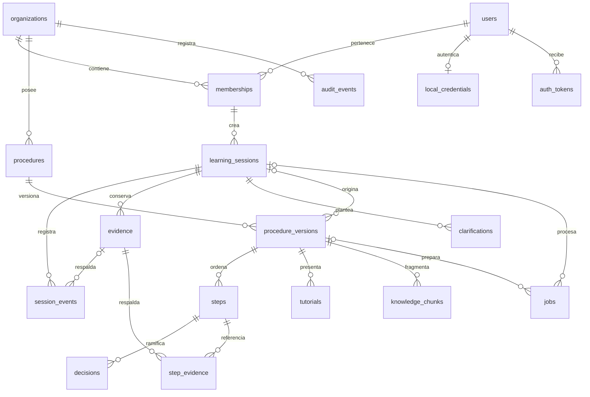
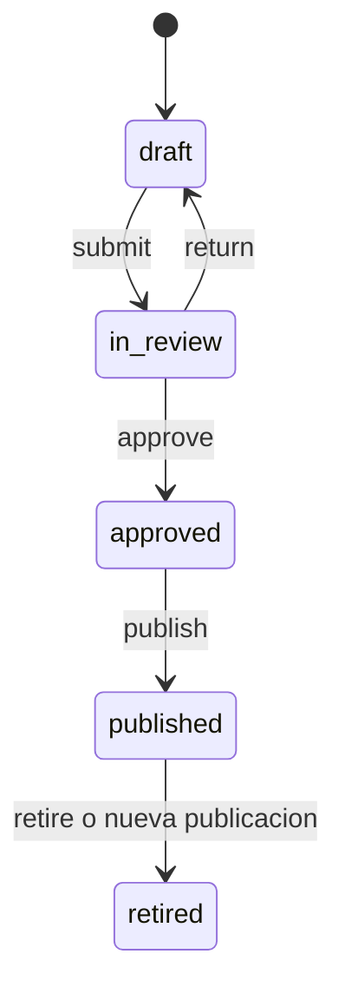

# Estructura de PostgreSQL

[Indice](../README.md) | [Tablas](02-tablas.md) | [Vectores](03-vectorial.md)

PostgreSQL es el servidor que guarda datos. pgAdmin es una interfaz para
administrarlo. cognitive es el nombre de la base; dentro hay un esquema tambien
llamado cognitive, que agrupa nuestras tablas. public es otro esquema de la misma
base, donde la migracion vectorial propone habilitar la extension vector.

```text
Servidor PostgreSQL 18
  Base cognitive
    Esquema cognitive
      users, organizations, memberships, ...
      knowledge_chunks             texto e indice textual
      chunk_embeddings             pendiente: vectores
    Esquema public
      extension vector             pendiente: tipos y operadores
  Otras bases del servidor          fuera del alcance de este proyecto
```

## Relaciones



Las lineas representan relaciones de negocio principales; las claves SQL incluyen
organization_id en muchas referencias. schema_migrations queda fuera del diagrama
porque registra despliegues y no datos del negocio. Los vectores futuros tienen
su propio diagrama en la siguiente guia.

## Por que estas entidades estan separadas

Una sesion registra lo explicado una vez. Un procedimiento identifica un proceso
estable y cada version conserva su contenido revisado. Los pasos pertenecen a una
version, no directamente al procedimiento; eso permite corregir una nueva version
sin modificar lo ya aprobado. La evidencia vive fuera del texto del paso y puede
respaldar varios pasos mediante step_evidence.

Las imagenes se guardan en disco local y evidence conserva su referencia, hash y
metadatos. El texto consultable esta en knowledge_chunks. Las contrasenas son hashes
en local_credentials y los tokens se guardan tambien como hashes en auth_tokens.

## Aislamiento y consistencia

organization_id diferencia equipos o clientes. Por ejemplo, una referencia
compuesta (organization_id, session_id) impide asociar un evento de una organizacion
a una sesion de otra. Esto evita referencias incorrectas, pero no impide por si solo
que una consulta SQL lea otra organizacion. La API verifica membresia y filtra SQL;
no hay Row Level Security configurado. Una cuenta administradora de pgAdmin tiene
otro nivel de acceso y no reproduce los permisos de un usuario de la API.

UUID identifica registros; las claves foraneas validan relaciones; UNIQUE evita
duplicados; CHECK restringe estados y rangos. timestamptz representa instantes con
zona horaria. JSONB se usa en payload/details, no para reemplazar todas las relaciones.
Las restricciones SQL completas estan en las migraciones.

## Ciclo editorial



Solo draft se edita mediante la API. Publicar retira la version publicada previa
y genera fragmentos textuales en una transaccion. Un indice unico parcial limita
a una version published por procedimiento. No hay trigger general que haga
inmutables las versiones ante SQL administrativo: esas reglas viven en la API.

La sesion tiene otro ciclo: capturing pasa a processing al cerrar. completed y
failed existen en el esquema, pero el worker que los gestionara aun no esta activo.

## Estado de migraciones y comprobacion

| Archivo | Efecto | Ultima verificacion registrada |
| --- | --- | --- |
| 001_initial.sql | 16 tablas de negocio y schema_migrations | Aplicada |
| 004_local_auth.sql | local_credentials y auth_tokens | Aplicada |
| 002_pgvector.sql | Extension y chunk_embeddings | Preparada, no aplicada |
| 003_Query | Consulta de comprobacion | No es migracion |

Son 19 tablas previstas con 001+004 y 20 al aplicar ademas 002.
Para comprobar el estado actual sin modificar datos, abrir Query Tool sobre cognitive:

```sql
SELECT current_database();
SELECT version, applied_at FROM cognitive.schema_migrations ORDER BY version;
SELECT tablename FROM pg_tables WHERE schemaname = 'cognitive' ORDER BY tablename;
SELECT count(*) FROM pg_tables WHERE schemaname = 'cognitive';
```

En el arbol: Databases > cognitive > Schemas > cognitive > Tables. Actualizar el
arbol si acaba de ejecutarse una migracion. No volver a ejecutar 001 en una base
ya preparada: CREATE SCHEMA/TABLE fallara. Los archivos usan transacciones; ante
un error ejecutar ROLLBACK antes de corregir y reintentar.

[SQL inicial](../../../migrations/001_initial.sql), [autenticacion](../../../migrations/004_local_auth.sql)
y [modelos ORM](../../../src/cognitive_os/infrastructure/database/models.py).
