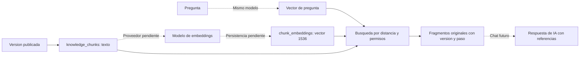
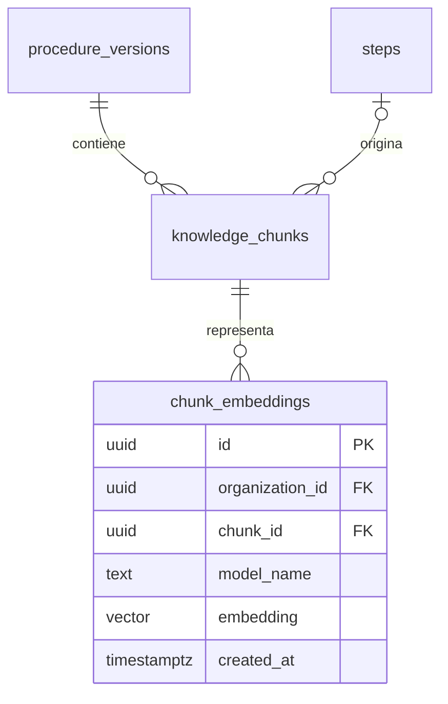

# Base vectorial: que es y como se usara

Actualizacion 2026-09-16: [indexacion implementada, tablas y uso](04-video-y-vectores.md).
El contenido inferior conserva el estado inicial de la extension.

[Indice](../README.md) | [Tablas](02-tablas.md)

## Estado real

Se verificaron por SQL extension vector 0.8.6 y cognitive.chunk_embeddings en la
base real. No volver a aplicar [002_pgvector.sql](../../../migrations/002_pgvector.sql)
sobre tablas existentes. Los pasos de instalacion siguientes son para una base
nueva. Generacion de embeddings y busqueda semantica aun no estan implementadas.
GET /api/v1/knowledge/search ya funciona en codigo, pero usa busqueda textual.

No necesitas una segunda base llamada vectorial. La propuesta es guardar los
vectores dentro de cognitive, mediante pgvector. La extension agrega tipos de
vectores y operadores de distancia a PostgreSQL. [Proyecto oficial](https://github.com/pgvector/pgvector).

## Explicacion con un ejemplo

Un fragmento dice: "El supervisor autoriza las cotizaciones de alto monto".
Una pregunta dice: "Quien da el visto bueno cuando el valor es elevado?".
Aunque no compartan todas las palabras, un modelo de embeddings puede producir
representaciones numericas cercanas para ambos textos. La busqueda compara esas
representaciones y recupera el texto original, que sigue guardado por separado.

Un embedding es una lista de numeros calculada por un modelo. No son coordenadas
geograficas, no es un resumen legible y no es un hash criptografico. En nuestro
esquema se eligieron 1536 dimensiones: cada vector tendra exactamente 1536 numeros.
Este numero proviene de la migracion preparada; el proveedor aun no esta conectado.



La recuperacion de fragmentos no genera por si misma una respuesta. RAG es el
paso posterior que entrega esos fragmentos a un modelo generativo y devuelve una
respuesta con referencias. Un resultado cercano no garantiza que sea correcto.

## Relacion con las tablas



chunk_embeddings es futura. Se puede conservar una representacion por modelo
para cada fragmento; nunca comparar vectores de modelos distintos, aunque tengan
la misma dimension. Cambiar dimension exige otra migracion. Cambiar modelo exige
regenerar los embeddings o mantenerlos separados por model_name.

## 1. Comprobar disponibilidad

En Query Tool de cognitive, ejecutar solo estas consultas de lectura:

```sql
SELECT current_database();
SELECT name, default_version, installed_version
FROM pg_available_extensions WHERE name = 'vector';
SELECT extname, extversion FROM pg_extension WHERE extname = 'vector';
SELECT to_regclass('cognitive.chunk_embeddings') AS tabla_vectorial;
```

Sin filas en pg_available_extensions, faltan los archivos de la extension en el
servidor. Disponible pero no instalada significa que falta habilitarla en esa base.
Una tabla nula significa que no existe en ese esquema. La presencia de la extension
en otra base no la habilita automaticamente en cognitive.

## 2. Instalar y aplicar la migracion

En Windows, la instalacion oficial compila pgvector con herramientas C++ de Visual
Studio y nmake, apuntando a la instalacion de PostgreSQL correspondiente. La ultima
revision del equipo no encontro ese compilador. Seguir las
[instrucciones oficiales de Windows](https://github.com/pgvector/pgvector#windows)
con una version estable compatible. No sustituir el PostgreSQL existente para
seguir un ejemplo basado en otro servidor.

Una vez disponibles los archivos, abrir 002_pgvector.sql en Query Tool conectado
a cognitive y ejecutarlo una sola vez. Ese archivo hace CREATE EXTENSION y crea
la tabla. No crear la tabla manualmente antes, porque la migracion fallaria.
La migracion admite aplicarse despues de 004; su numeracion no obliga a reinstalar
las otras migraciones. Ante error, ROLLBACK antes de reintentar.

Luego verificar el registro schema_migrations y la tabla. En pgAdmin:

```text
Databases > cognitive > Extensions > vector
Databases > cognitive > Schemas > cognitive > Tables > chunk_embeddings
```

Actualizar el arbol. Una tabla vacia significa que el almacenamiento esta listo,
no que exista conocimiento vectorizado.

## 3. Probar la idea con numeros ficticios

Solo despues de instalar la extension. Este ejemplo SQL crea una tabla TEMP de
3 dimensiones y revierte todo al terminar; no toca las tablas del producto.
Los vectores se inventaron para mostrar la operacion, no representan lenguaje real.
El operador <=> calcula distancia coseno: menor distancia indica mayor cercania.
[Operadores de pgvector](https://github.com/pgvector/pgvector#querying).

```sql
BEGIN;
CREATE TEMP TABLE vector_demo (texto text, embedding public.vector(3));
INSERT INTO vector_demo VALUES
  ('Ejemplo cercano', '[1,0,0]'),
  ('Ejemplo diferente', '[0,1,0]');
SELECT texto, embedding <=> '[0.9,0.1,0]'::public.vector(3) AS distancia
FROM vector_demo ORDER BY distancia;
ROLLBACK;
```

La tabla del producto exige 1536 dimensiones; no intentar insertar estos vectores
de 3 componentes en chunk_embeddings. Los SQL ilustrativos de esta guia no se
ejecutaron en la base real porque pgvector sigue pendiente.

## 4. Guardar embeddings reales

El futuro worker debe leer knowledge_chunks, enviar content al modelo elegido,
validar 1536 numeros finitos y guardar el resultado con chunk_id/model_name.
La publicacion actual crea texto pero no ejecuta este paso.
Este SQL esta pensado para cursor.execute de psycopg, con parametros enlazados;
no pegar los marcadores %(...)s directamente en Query Tool.

```sql
INSERT INTO cognitive.chunk_embeddings
    (organization_id, chunk_id, model_name, embedding)
SELECT c.organization_id, c.id, %(model)s, %(vector)s::public.vector(1536)
FROM cognitive.knowledge_chunks c
JOIN cognitive.procedure_versions v
  ON v.id = c.version_id AND v.organization_id = c.organization_id
WHERE c.id = %(chunk_id)s AND c.organization_id = %(organization_id)s
  AND v.status = 'published'
ON CONFLICT (organization_id, chunk_id, model_name)
DO UPDATE SET embedding = EXCLUDED.embedding;
```

vector es una cadena serializada como [numero1,numero2,...] con 1536 valores;
model identifica exactamente el modelo/configuracion utilizado. organization_id
se obtiene de autorizacion en servidor, no de una afirmacion libre del cliente.
Esta receta parte del flujo actual que crea fragmentos al publicar; cuando se
prepare el indice antes de publicar habra que adaptar el worker y la transaccion.

## 5. Buscar con permisos

Convertir la pregunta con el mismo modelo y pasar el vector a una consulta como
esta. Tambien usa parametros de psycopg. Devuelve texto, version y paso para citar.

```sql
SELECT c.id, c.content, c.version_id, v.version_number, c.step_id,
       e.embedding <=> %(query_vector)s::public.vector(1536) AS distancia
FROM cognitive.chunk_embeddings e
JOIN cognitive.knowledge_chunks c
  ON c.id = e.chunk_id AND c.organization_id = e.organization_id
JOIN cognitive.procedure_versions v
  ON v.id = c.version_id AND v.organization_id = c.organization_id
WHERE e.organization_id = %(organization_id)s
  AND e.model_name = %(model)s AND v.status = 'published'
ORDER BY distancia, c.id
LIMIT 5;
```

Filtrar por organizacion, modelo y publicacion evita mezclar clientes, espacios
vectoriales o versiones retiradas. El texto original se devuelve desde c.content.
Esto todavia no tiene endpoint implementado; no confundirlo con /knowledge/search.

## 6. Indices y operaciones futuras

La migracion comienza con busqueda exacta. HNSW es un indice opcional para busqueda
aproximada cuando las mediciones lo justifiquen; consume recursos y puede cambiar
los resultados. Evaluar filtros de organizacion/modelo y calidad antes de activarlo.
[Indices de pgvector](https://github.com/pgvector/pgvector#indexing).

Faltan proveedor, generacion/reintentos, aislamiento del worker, reconstruccion del
indice al cambiar modelo, eliminacion de derivados y endpoint de recuperacion.
El modelo generativo y los embeddings necesitan configuracion propia; instalar
pgvector no descarga un modelo ni entrena automaticamente al sistema.
