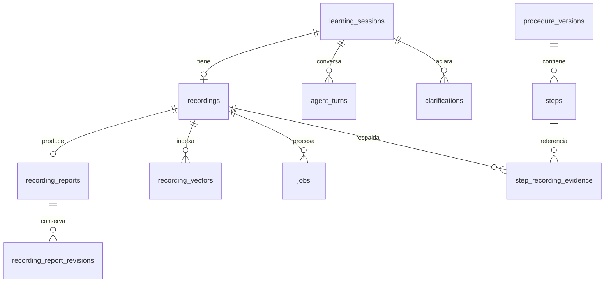

# Video, conocimiento y base vectorial

Estado 2026-09-18. [Flujo y endpoints](../guias/06-aprendizaje-visual.md).

## Que se guarda donde

| Lugar | Datos | Uso |
| --- | --- | --- |
| Blob Storage privado | Video original y snapshot inmutable | Reproducir y volver a analizar |
| recordings | Organizacion, sesion, MIME, tamano, hash, consentimiento, estado y referencia privada | Control de acceso/subida |
| recording_reports | Resumen, informe, pasos, fotogramas/tiempos, transcripcion, revision y aprobacion | Fuente relacional del conocimiento |
| recording_report_revisions | Instantaneas de revisiones anteriores | Trazabilidad de cambios |
| agent_turns | Mensajes, respuestas e idempotencia | Conversacion recuperable; no imagenes en vivo |
| clarifications | Preguntas y respuestas del usuario, incluidas las que el agente de voz pregunta por su cuenta | Resolver ambiguedades |
| realtime_voice_sessions | Una fila por llamada de voz en vivo: modelo, estado, motivo y hora de cierre | Auditar/limitar sesiones Realtime concurrentes |
| session_events (`realtime_voice_transcript`) | Segmentos de transcripcion de la llamada de voz, con hablante | Insumo del analisis visual sin volver a transcribir el video |
| jobs | Trabajo, intentos, lease, error sanitizado | Reanudar procesamiento sin duplicar |
| procedure_versions / steps / step_recording_evidence | Procedimiento y enlace a video/revision/fotogramas | Publicacion gobernada |
| recording_vectors | Fragmento de informe aprobado + vector 1536 + fuente/modelo/revision + status (`active`/`superseded`) + superseded_by | Busqueda semantica de videos |
| knowledge_chunks / chunk_embeddings | Esquema previo de conocimiento de procedimientos | Publicacion y futura ampliacion semantica |



## Como funciona

1. La IA interpreta fotogramas y contexto. El usuario corrige y aprueba el informe.
2. Aprobar encola `index_recording`. El worker divide resumen/informe/pasos en
   fragmentos pequenos conservando fuentes. No indexa transcripcion cruda sin revisar.
3. OpenAI genera un vector numerico por fragmento con `text-embedding-3-small`,
   solicitando 1536 dimensiones. pgvector vive dentro de PostgreSQL, no otra DB.
4. Ante una pregunta, se genera su vector con el mismo modelo y se ordenan los
   fragmentos por similitud coseno. Se filtra organizacion, modelo, revision aprobada
   y `status='active'`.
5. Se devuelve texto, score, recording_id, session_id, revision y fuente. El score
   es similitud, no probabilidad de verdad ni porcentaje de confianza.
6. Si la grabacion pertenece a un procedimiento (`learning_sessions.procedure_id`)
   que ya tenia fragmentos indexados de otra grabacion, el worker compara los
   fragmentos nuevos contra esos fragmentos activos y, solo ante candidatos
   similares, pide a un modelo curador separado (`OPENAI_CURATOR_MODEL`) que
   decida cuales quedan `superseded`. Ver
   [guias/06-aprendizaje-visual.md](../guias/06-aprendizaje-visual.md).

La busqueda actual devuelve fragmentos, no una respuesta RAG redactada. No entrena
ni modifica los pesos del modelo. Un chat RAG con citas y abstencion queda pendiente.
Los procedimientos solo textuales aun no se indexan automaticamente: no confundir
la tabla previa `chunk_embeddings` con el nuevo flujo completo de videos.

No hay vectores ficticios en la base de desarrollo. Sin API key el trabajo espera
al worker configurado. Las pruebas usan vectores deterministas solo en DB aislada.
La busqueda es exacta y aislada por tenant; agregar HNSW solo con mediciones de
volumen/recall. Cambiar el modelo exige reindexar; cambiar dimensiones exige migracion.

## Como probarlo

1. Completar credenciales y ejecutar workers de analisis e indexacion.
2. Grabar, subir, analizar, resolver preguntas y aprobar informe.
3. `GET /api/v1/recordings/{id}/index`: debe mostrar indexed=true y chunks > 0.
4. Recuperar trabajo en `/learning-sessions/{id}/jobs`. Si fallo, `POST /.../index`
   reencola el mismo trabajo; tambien permite indexar informes aprobados previamente.
5. `POST /api/v1/recordings/search` con `{"query":"Como registrar un pedido?","limit":5}`.
6. Mostrar resultados con fuente y enlace al video, no un resumen sin respaldo.

En pgAdmin: cognitive > Schemas > cognitive > Tables > recording_vectors.
Consulta de inspeccion, sin exponer los vectores completos:

```sql
SELECT recording_id, report_revision, position, model_name,
       public.vector_dims(embedding) AS dimensions, left(content, 120) AS fragment
FROM cognitive.recording_vectors
ORDER BY created_at DESC LIMIT 20;
```

Las migraciones 005/006/007/010/011 son aditivas; 011 (status/superseded_by) esta
pendiente de aplicar en la base local igual que 010.
El control multiempresa se aplica en consultas de la API y claves foraneas compuestas;
no se debe exponer PostgreSQL directamente a usuarios finales como sustituto de RBAC.

Referencia: [OpenAI Docs: embeddings](https://developers.openai.com/api/docs/guides/embeddings).
Se usan para recuperar textos relacionados; el video sigue siendo un archivo en Blob.
