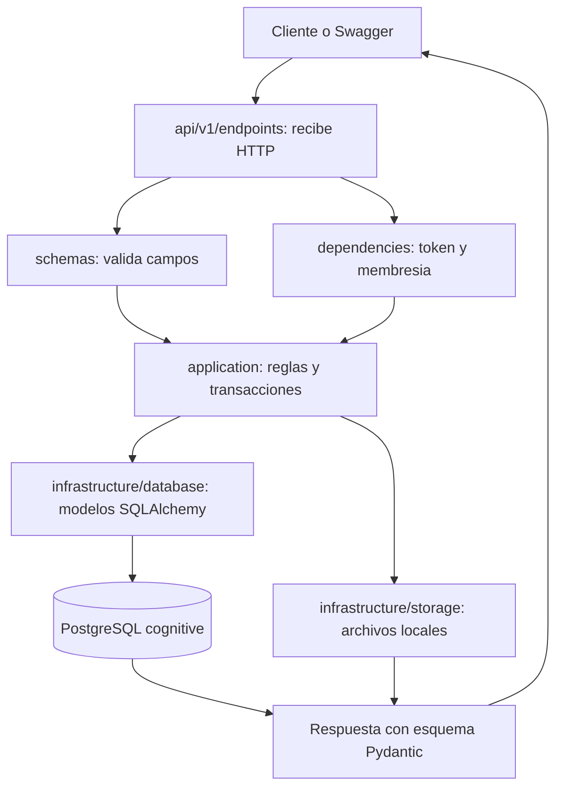
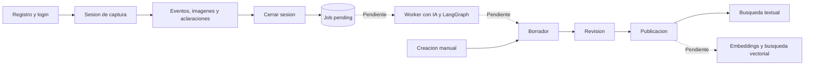

# Como esta organizada la API

[Volver al indice](../README.md)

Cognitive OS busca convertir la explicacion de un experto en un procedimiento
revisado y consultable. Ahora existe el backend de captura y edicion manual.
Todavia no existe el componente que observa las capturas con IA y aprende el flujo.

## Camino de una solicitud

Por ejemplo, al cerrar una sesion el endpoint valida su UUID y al usuario;
el caso de uso comprueba evidencias y dudas pendientes; SQLAlchemy guarda el
cierre y el job juntos. La respuesta describe el trabajo creado.

## Carpetas

| Carpeta o archivo | Responsabilidad real |
| --- | --- |
| src/cognitive_os/main.py | Crea FastAPI, administra conexion y traduce errores |
| api/v1/router.py | Registra los grupos de rutas |
| api/v1/endpoints/ | Parametros HTTP, respuestas y coordinacion con casos de uso |
| api/dependencies.py | Token, sesion SQL y permisos por organizacion |
| schemas/ | Modelos Pydantic de solicitudes y respuestas |
| application/ | Registro, sesiones, evidencias, ciclo editorial y transacciones |
| domain/errors.py | Error esperado de aplicacion; aun es un dominio pequeno |
| infrastructure/database/models.py | Mapeo ORM de las tablas usadas por los endpoints |
| infrastructure/storage/local.py | Validacion de imagenes y almacenamiento local |
| infrastructure/ai/ y workers/ | Espacios reservados, sin procesamiento implementado |
| core/ | Variables de configuracion y limite de autenticacion |
| migrations/ | SQL que define tablas, restricciones e indices |
| tests/ | Pruebas de permisos, flujos, concurrencia y archivos |

La separacion es pragmatica: application utiliza SQLAlchemy y algunos schemas
directamente; no existe una capa abstracta de repositorios. Algunas rutas simples,
como las aclaraciones, todavia contienen su consulta SQL en el endpoint.

Un modelo Pydantic valida el JSON; un modelo SQLAlchemy mapea filas; un modelo de
IA interpreta o genera contenido. Son tres conceptos diferentes. El tercero aun
no esta integrado. Las migraciones son la autoridad del esquema, no create_all.

## Flujo implementado y futuro

Hoy el job queda pending; la sesion queda processing. El usuario puede preparar
el procedimiento manualmente por los endpoints, pero eso no completa el job.

LangGraph podria coordinar observacion, aclaracion y consolidacion con puntos
de pausa. No sustituye PostgreSQL, los permisos ni las transacciones editoriales.
Ver [propuesta de orquestacion](../../orquestacion.md).
