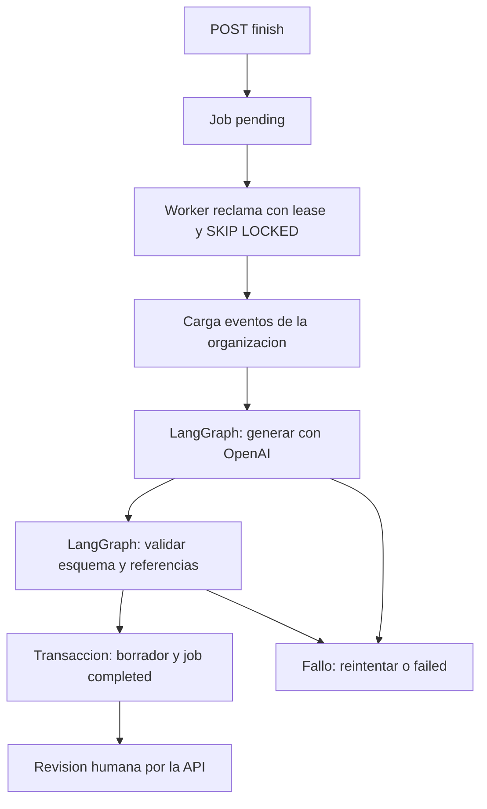

# Orquestacion: captura a borrador

[Indice](../README.md) | [Backlog](../planificacion/product-backlog.md)

Modelo por defecto: `gpt-5.6-luna`, elegido por el usuario. Se verifico por SQL
extension vector 0.8.6 y tabla cognitive.chunk_embeddings en la base real.
No se modifico su esquema ni se generaron vectores en esta entrega.



El modelo no tiene herramientas, credenciales ni permisos SQL/publicacion.
Las referencias deben pertenecer a la captura. Esto no demuestra la veracidad
del contenido: los pasos quedan pending y requieren confirmacion humana.

## Configurar y ejecutar

En `.env`, usar una clave nueva, no la compartida en el chat:

```dotenv
OPENAI_API_KEY=REEMPLAZAR_LOCALMENTE
OPENAI_MODEL=gpt-5.6-luna
OPENAI_BASE_URL=https://api.openai.com/v1
COGNITIVE_WORKER_LEASE_SECONDS=300
```

Tambien se necesita COGNITIVE_DATABASE_URL. Instalar dependencias con
`.venv/Scripts/python.exe -m pip install -e '.[dev]'`.
La API sigue usando main:app; mis ejecuciones utilizan `--port 8001`.

El worker es separado para que recargar la API no duplique workers. No arranca
automaticamente con main.py. Sustituir el UUID del siguiente comando por uno propio.
Ejecutarlo puede consumir saldo si hay un trabajo disponible:

```powershell
.venv/Scripts/python.exe -m cognitive_os.workers --once --organization-id UUID_DE_TU_ORGANIZACION
```

Sin `--once`, consulta la cola continuamente; Ctrl+C lo detiene. Sin organizacion,
procesa toda la base: es una herramienta administrativa, no un endpoint publico.
No ejecutarla sobre datos que no deban enviarse al proveedor.

## Recorrido

1. Crear sesion, agregar eventos message/transcript de texto y terminarla.
2. Ejecutar el worker con configuracion local y organizacion elegida.
3. Consultar GET /api/v1/jobs/{job_id} con token y X-Organization-ID.
4. Al estar completed, usar version_id para consultar la version y sus pasos.
5. Corregir y confirmar pasos antes de enviar a revision por los endpoints existentes.

Se crea un procedimiento nuevo con version 1 draft, pasos pendientes y tutorial
Markdown basado en esos pasos. La version registra modelo/prompt y audit_events
conserva eventos fuente por paso. Sesion completed no significa publicacion.

## Resiliencia

- Hasta max_attempts (3 por defecto), con espera exponencial limitada.
- Una llamada por intento; timeout 90 segundos, sin reintentos del SDK.
- Hasta 6000 tokens de salida y 50 pasos; entrada de 1 a 200 eventos y 100000 bytes.
- No hay truncamiento silencioso ni transacciones SQL abiertas durante la llamada.
- Un token nuevo por reclamo impide guardar a un worker con lease vencido.
- Borrador y completed se guardan atomicamente; errores como codigos sin secretos.

Al agotar intentos, la sesion queda failed; reencolado manual por API pendiente.
Una caida puede repetir la llamada externa y su coste; la persistencia del mismo
job esta protegida contra duplicados. No hay checkpoints por nodo: se repite el grafo.

## Pendiente

Imagenes/audio, respuestas a aclaraciones en el prompt, preguntas interactivas,
checkpoints por nodo, embeddings y busqueda semantica/RAG. Una captura solo con
imagenes falla controladamente. pgvector instalado no significa RAG implementado.
El modelo de embeddings se elige por separado para la dimension del esquema.

Acceso real a Luna pendiente de clave local valida. Verificacion: 29 pruebas con
PostgreSQL temporal y proveedor simulado; no se hicieron llamadas pagadas.

Fuentes: [OpenAI Luna](https://developers.openai.com/api/docs/models/gpt-5.6-luna),
[salidas estructuradas](https://developers.openai.com/api/docs/guides/structured-outputs),
[LangGraph](https://docs.langchain.com/oss/python/langgraph/graph-api).
