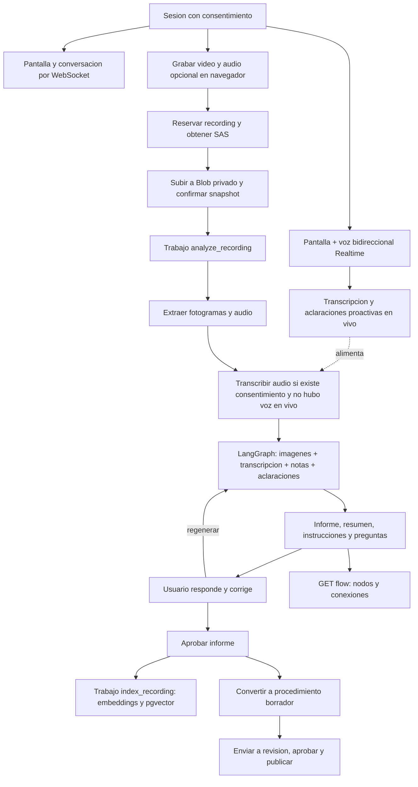

# Aprendizaje visual: contrato backend y frontend

Estado al 2026-09-18. Implementado y probado con PostgreSQL/pgvector reales aislados,
video/audio locales y proveedores de IA/Azure simulados. No se hicieron llamadas
reales de pago ni se valido una cuenta Azure ni OpenAI Realtime. [Credenciales pendientes](../planificacion/lo-que-necesito.md).

## Flujo completo



El modelo no recibe ni reproduce un archivo de video completo: recibe fotogramas
muestreados cada 10 segundos, mas contexto textual. Puede perder acciones entre
fotogramas. El informe conserva esta limitacion; no equivale a observar cada frame.
El canal `/agent/live` sigue siendo mensajes y capturas puntuales (sin voz). El
canal `/agent/live-voice` agrega voz bidireccional real vía OpenAI Realtime API,
capturas periodicas y preguntas proactivas del modelo, mediadas siempre por el
backend (ver [ficha del endpoint](../endpoints/63-agent-live-voice.md)). Ninguno de los
dos transmite video continuo: la pantalla sigue llegando como capturas puntuales,
no como stream de frames. `gpt-5.6-luna` genera texto/vision; `gpt-realtime`
conversa por voz; `gpt-4o-mini-transcribe`/Whisper transcriben audio grabado;
`text-embedding-3-small` genera vectores; un modelo curador separado
(`OPENAI_CURATOR_MODEL`, por defecto `gpt-5.6-luna`) decide, solo dentro del
worker `index_recording`, si un fragmento nuevo reemplaza a uno ya indexado del
mismo procedimiento. Nunca conversa con el usuario ni ve la grabacion completa:
recibe unicamente pares de fragmentos cortos que el filtro de similitud de
embeddings ya preselecciono como casi duplicados.

## Ejecutar

Desde la raiz, instalar `pip install -e ".[dev]"` en `.venv`. Migraciones en orden:
001, 002, 004, 005, 006, 007, 008, 009, 010. No ejecutar `003_Query` como migracion.
La base local ya tiene estas migraciones; no repetirlas sobre tablas existentes.
El script `scripts/test_postgres.ps1` crea otra base aislada y la apaga al terminar.

API desde PyCharm Run con `main:app`, puerto 8000. Desde consola:

```powershell
.venv/Scripts/python.exe -m uvicorn main:app --host 127.0.0.1 --port 8000
```

Los workers son procesos separados, cada comando en su propia consola:

```powershell
.venv/Scripts/python.exe -m cognitive_os.workers --kind analyze_recording
.venv/Scripts/python.exe -m cognitive_os.workers --kind index_recording
.venv/Scripts/python.exe -m cognitive_os.workers --kind consolidate
```

El ultimo procesa sesiones textuales sin video. Agregar `--once` para un solo
trabajo o `--organization-id UUID` para limitar la organizacion. No arrancan con
FastAPI; cerrar con Ctrl+C. Sin workers, los trabajos quedan `pending`, no completados.
Las llamadas externas se hacen fuera de transacciones largas. Los trabajos usan
leases, tres intentos y verificacion del propietario antes de guardar resultados.

## Almacenamiento y reproduccion

Todas las rutas HTTP siguientes llevan prefijo `/api/v1`, Bearer y
`X-Organization-ID`. `reader` no puede consultar capturas originales.

1. Consultar `GET /recordings/capabilities` antes de habilitar captura/subida.
2. Crear sesion con consentimiento y reservar `POST /learning-sessions/{id}/recordings`.
3. Enviar `idempotency_key` UUID estable, `media_type` (`video/webm` o `video/mp4`),
   `size_bytes`, `consent: true`, `audio_consent` y opcional `content_sha256` hexadecimal.
4. Pedir `POST /recordings/{id}/upload-url`. Hacer PUT a `url` usando solamente
   `headers` de la respuesta. No enviar Bearer de la API al dominio de Azure.
5. `POST /recordings/{id}/complete` verifica tamano/tipo y congela un snapshot.
6. `POST /recordings/{id}/process` retorna 202 y un Job. Tambien sirve finish-session.
7. Consultar `GET /learning-sessions/{id}/jobs` o el endpoint existente de trabajo.

Limites por defecto: una grabacion por sesion, 250 MiB y 10 minutos. Los limites
reales de duracion/decodificacion se verifican en el worker. Un archivo con MIME
permitido pero corrupto o codec no interpretable puede fallar el analisis.

`GET /recordings/{id}/playback` devuelve `{url, method: "GET", headers: {}, expires_at}`.
Asignar URL directamente a `<video src=... controls playsInline>`. Azure soporta
solicitudes parciales; no descargar como JSON ni convertir la URL en enlace Markdown.
La URL es privada, temporal (5 minutos), de solo lectura y apunta al snapshot.
Solicitar otra URL al vencer o ante error de autorizacion; conservar currentTime y
restaurarlo despues de `loadedmetadata`. No persistir SAS en logs o base de datos.
El backend fuerza MIME de video y `Content-Disposition: inline` en el SAS.

Correccion en `ScreenStudio.tsx` del frontend: limpiar `srcObject` en el cleanup
y usar keys diferentes para video en vivo y grabado. Antes React podia reutilizar
el elemento manteniendo el MediaStream finalizado por encima de `src`.
Prueba Playwright/Edge real con captura sintetica: imagen visible y currentTime
avanzando; capturas desktop/movil en `.data/playback-*.png` del backend.
Esto no certifica reproduccion remota Azure ni todos los codecs/navegadores.

Configurar CORS de Blob (distinto al CORS de FastAPI), una vez con credenciales:

```powershell
.venv/Scripts/python.exe -m cognitive_os.infrastructure.storage.setup_azure --origin http://localhost:5173
.venv/Scripts/python.exe -m cognitive_os.infrastructure.storage.setup_azure --origin http://127.0.0.1:5173
```

El comando crea el contenedor privado si falta y agrega reglas a la cuenta:
GET, HEAD, PUT, OPTIONS; Range, Content-Type y x-ms-*; expone ETag/Content-Range/
Content-Length. Revisar reglas existentes de la cuenta antes de usarlo en produccion.

## Subidas reanudables

El frontend actual usa PUT completo. Para reanudar tras recarga:

1. Calcular SHA-256 del archivo y enviarlo en la reserva inicial. Persistir el ID
   de reserva en el estado de la sesion, nunca la URL SAS.
2. `GET /recordings/{id}/upload-status` devuelve bloques de 4 MiB, con `id`, `index`,
   `size_bytes` y `uploaded`. Volver a seleccionar el mismo archivo y comparar hash.
3. Obtener nuevo upload-url. Por bloque pendiente usar PUT al SAS agregando
   `&comp=block&blockid=` + `encodeURIComponent(block.id)`, con el slice binario.
   No enviar `x-ms-blob-type` en Put Block; es encabezado de Put Blob completo.
4. `POST /recordings/{id}/commit-blocks` verifica el manifiesto, confirma y congela.
5. Si la confirmacion se pierde, repetirla: es idempotente. No reservar otro ID.

La verificacion SHA-256 integral sucede al descargar en el worker; bloques existentes
con el mismo tamano no prueban identidad. El frontend debe rechazar otro archivo.
El video no esta guardado en el servidor hasta completar la subida; ObjectURL es
solo memoria del navegador y desaparece al recargar.

## Observacion y conversacion

Abrir `ws://127.0.0.1:8000/api/v1/learning-sessions/{id}/agent/live` en desarrollo;
`wss://` en produccion. Primer mensaje, dentro de 15 segundos:

```json
{"type":"auth","token":"TOKEN_LOCAL","organization_id":"UUID","consent":true}
```

El servidor responde `ready`. No poner token en URL ni OPENAI_API_KEY en frontend.
Mandar un turno a la vez y esperar reply/error:

```json
{"type":"observe","message_id":"UUID","text":"Estoy registrando un pedido","image_base64":"BASE64_JPEG_SIN_PREFIJO_DATA"}
```

`type: "message"` tambien acepta texto sin imagen. Respuestas: `processing`,
`reply` con `message_id` y campos del agente, o `error` con status/detail.
Ver esquema exacto en [ficha WebSocket](../endpoints/62-agent-live.md).
Limites: imagen JPEG/PNG de hasta 512 KB, maximo 1920x1080; 240 turnos/sesion
(`agent_max_turns_per_session`), intervalo minimo 3 segundos; sesiones en captura
y permiso de escritura. Reutilizar message_id con el mismo contenido para
reintento; diferente contenido da 409. El historial se recupera por
`GET /learning-sessions/{id}/agent/messages`. Las imagenes del canal en vivo no
se guardan; el texto y la respuesta si. Vite necesita `ws: true` en proxy `/api`
si el socket usa el dominio del frontend.

### Voz bidireccional (`/agent/live-voice`)

Mismo primer paso de autenticacion, pero el protocolo es continuo, no por turnos:
audio del microfono en tramas binarias, capturas de pantalla periodicas cada
`observation_interval_seconds` (15s por defecto) en tramas de texto, y audio de
respuesta (TTS) llegando tambien en tramas binarias. El modelo decide por su
cuenta cuando preguntar algo (`ask_clarifying_question`, mapeada al mismo tool
call de la Realtime API); esa pregunta llega como `clarification.created` sin
que el usuario haya escrito nada, y se guarda como `Clarification` igual que hoy.
Solo una sesion de voz activa por `learning_session`; una segunda conexion
mientras la primera sigue abierta recibe 409. Duracion maxima configurable
(`realtime_session_max_seconds`, 30 minutos por defecto); el servidor revalida
la autorizacion periodicamente, no solo al conectar. Detalle completo, formato
de audio y eventos en [ficha del endpoint](../endpoints/63-agent-live-voice.md).

## Audio, notas, aclaraciones e informe

Capturar microfono solo con permiso y `audio_consent: true` al reservar. El backend
extrae WAV mono 16 kHz, transcribe y combina con eventos `message`/`transcript`,
texto del usuario en turnos en vivo y aclaraciones resueltas. Las respuestas del
agente no se usan como evidencia del usuario. No se inventa transcripcion cuando
no hay audio o consentimiento. `GET /recordings/{id}/transcript` explica ese estado.

Si la sesion tuvo una llamada de voz en vivo (`/agent/live-voice`), su
transcripcion ya quedo guardada como eventos `realtime_voice_transcript` (no
expuestos por `POST .../events`, distintos del `transcript` que puede enviar el
cliente) y el worker `analyze_recording` la usa directamente como
`context["transcript"]`: no vuelve a transcribir el audio del video grabado con
Whisper, aunque haya `audio_consent`. El sampling del informe queda con
`audio_exclusion_reason: "live_voice_transcript_available"` en ese caso, para
distinguirlo de la falta de consentimiento.

`GET /.../report` devuelve contenido, sampling, revision y estado de revision.
Las instrucciones contienen `frame_indices` y `text_sources` (transcript, notes,
clarifications). Las preguntas del modelo se guardan tambien como Clarification.
Usar los endpoints existentes de aclaraciones para responder incluso despues del
analisis, antes de aprobar. Luego `POST /.../report/regenerate` con `{revision: N}`.
La regeneracion conserva el informe anterior en `/report/history` y deja el nuevo
pendiente de revision. `PUT /.../report` permite edicion humana con control revision.
Revisiones viejas dan 409; refrescar, no sobrescribir a ciegas.

`POST /.../report/review` con `{revision: N, decision: "approved"}` exige resolver
preguntas abiertas. El informe aprobado es inmutable y encola indexacion vectorial.
`POST /.../procedure` crea un procedimiento borrador con pasos confirmados y enlaces
al video/revision; repetir retorna la misma version. No publica automaticamente:
usar los endpoints existentes submit, approve y publish de procedure-versions.

## Consolidacion de conocimiento entre grabaciones

Cuando el cliente actualiza un procedimiento con una sesion/grabacion nueva
(`learning_sessions.procedure_id` ya apuntaba al mismo procedimiento, sea porque
se creo la sesion con ese `procedure_id` o porque una grabacion anterior ya se
convirtio en procedimiento), el worker `index_recording` no se limita a agregar
vectores: por cada fragmento nuevo busca en `cognitive.recording_vectors`
fragmentos `active` de OTRAS grabaciones del mismo procedimiento con similitud de
embedding sobre `COGNITIVE_KNOWLEDGE_SUPERSEDE_SIMILARITY` (0.75 por defecto).
Solo si aparecen candidatos llama al modelo curador (`OPENAI_CURATOR_MODEL`) con
esos pares cortos; si no hay candidatos, no hay llamada. El curador decide, por
fragmento nuevo, cuales de sus candidatos describen la misma regla/paso con
informacion distinta y deben marcarse `status='superseded'` con
`superseded_by` apuntando al fragmento nuevo. `search_vectors` (usado por
`POST /recordings/search`) solo devuelve fragmentos `active`, asi que una
respuesta nunca mezcla la version vieja y la corregida de un mismo hecho.
Una grabacion sin `procedure_id`, o la primera de un procedimiento, nunca llama
al curador: no hay nada con qué compararla. Migracion `011_knowledge_consolidation`.

## Grafico en el frontend

`GET /recordings/{id}/flow` no necesita IA adicional. Devuelve schema_version,
revision, review_status, title, kind=sequence, nodes, edges y uncertainties.
Los nodos ya tienen id/type/position/data; edges tienen id/source/target. Son datos
compatibles con una vista de nodos y aristas; no SVG/HTML generado por el modelo.
Mostrar el estado de revision y usar `data.frames[].timestamp_ms / 1000` para
seleccionar currentTime en el reproductor. Tras editar/regenerar refrescar el grafo.
Aplicar layout propio y alturas variables para etiquetas largas. Mostrar texto
escapado y sanitizar Markdown. El esquema actual representa secuencia, no decisiones
condicionales; edicion de ramas y reglas de negocio queda en el backlog.

## Integracion restante del frontend

- `ScreenStudio`: enviar capturas puntuales al socket solo con consentimiento;
  detener al ocultar/cerrar sesion. El arreglo del reproductor ya fue aplicado.
- `AgentConversation`: canal live, historial, reintentos por message_id y errores
  401/403/409/429/503 sin duplicar notas.
- Nuevo: captura de microfono + reproduccion de audio TTS para `/agent/live-voice`
  (tramas binarias PCM16), reenvio de las mismas capturas periodicas de pantalla
  que `ScreenStudio` ya toma, UI para preguntas empujadas sin que el usuario haya
  escrito nada (`clarification.created`) y manejo de `session.ending` para cortar
  el microfono con la razon visible al usuario.
- `RecordingUploadPanel`/`recordings.ts`: hash, bloques y recuperacion de reserva.
- `SessionMedia`: renovar playback vencido y mostrar MediaError.code; probar CORS
  y codec en navegador objetivo con el video real.
- `RecordingReport`: preguntas, text_sources, transcript, historial, regenerar,
  convertir a procedimiento y enlace a grafico. No marcar aprobado antes del 200.
- `JobProgress`: jobs por sesion; distinguir analyze_recording e index_recording.
- Buscador: `POST /recordings/search` para conocimiento de videos aprobados.
  Esta ruta de capturas no esta abierta al rol reader. La busqueda publicada
  textual existente permanece disponible con sus permisos originales.

No se modificaron los otros componentes del frontend para evitar interferir con
el trabajo actual del usuario; estos son los contratos para acoplarlos.
