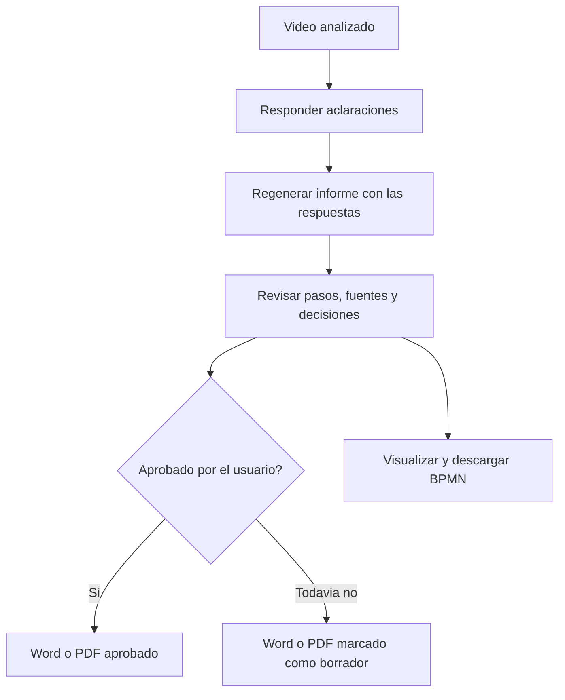

# Documentos con capturas y procesos BPMN

Actualizado: 2026-09-17 (America/Bogota).

## Recorrido del usuario



No se aprueba un informe automaticamente. Resolver una pregunta no cambia por
si solo los pasos: se debe regenerar el informe para integrarla en el analisis.
Las respuestas actuales tambien se incluyen como anexo del documento.

## Word y PDF

`POST /api/v1/recordings/{recording_id}/report/file`

Requiere Bearer y `X-Organization-ID`; disponible para owner, author y reviewer
de la organizacion. Un reader no puede obtener capturas de sesiones privadas.

```json
{"revision": 3, "format": "pdf", "style": "tutorial"}
```

- `format`: `pdf` o `docx`.
- `style`: `tutorial` o `report`. Ambos incluyen pasos, resultados, capturas,
  fuentes, condiciones, aclaraciones y limitaciones. El informe incluye ademas
  el texto completo del analisis.
- Respuesta: archivo binario con MIME correspondiente, `Content-Disposition`
  y `Cache-Control: no-store`; no JSON ni URL publica.
- El servidor exige video listo, revision vigente, actividades y preguntas
  resueltas. Un informe rechazado debe corregirse antes de exportar.
- Un informe pendiente se etiqueta BORRADOR; uno aprobado conserva su revision
  y fecha de revision humana. Exportar no modifica el informe ni su aprobacion.
- Se toma una copia consistente bajo el bloqueo de la sesion y se libera la
  transaccion antes de descargar o decodificar el video.

Las capturas se extraen del snapshot privado original de Azure. Se conserva el
intervalo utilizado en el analisis y se comprueba el timestamp de cada indice.
Si no coinciden, se rechaza la exportacion; no se inventan capturas.
Se incluyen hasta dos capturas citadas por actividad (primera y ultima). Los
pasos sustentados solo en texto se identifican como tales.

**Privacidad:** las capturas no se anonimizan automaticamente. Revisar datos
personales y permisos de distribucion antes de compartir el archivo descargado.
El documento no incluye claves ni URLs SAS.

### Limites de esta entrega

La descarga se genera durante la peticion HTTP, no como job persistente.
Hay dos exportaciones simultaneas por proceso API; un exceso responde 429.
El frontend admite hasta cinco minutos; un proxy o tunel puede imponer un limite
menor. Para documentos grandes en produccion falta llevar esta exportacion a
una cola durable, guardar el resultado privado en Blob y recuperar su estado.

Los temporales se eliminan al terminar; los documentos no se archivan en Azure
ni se indexan otra vez en pgvector. La informacion del informe aprobado sigue
usando el indice vectorial existente. Generar documentos/BPMN no consume IA.

## Diagrama de actividades

`GET /api/v1/recordings/{recording_id}/flow/bpmn`

Devuelve JSON con `xml`, `revision`, `review_status` y `recording_id`.
El XML es BPMN 2.0 con coordenadas de diagrama:

- Pool del proceso y carril Usuario.
- Evento de inicio, actividades `userTask` y evento de fin.
- Cada alternativa del informe crea una compuerta exclusiva separada de la
  actividad y flujos con sus condiciones.
- Se mantienen los IDs `step-N`; `decision-N` referencia la misma actividad
  para recuperar las fuentes desde `/flow`.
- La etiqueta de actividad se abrevia cuando es extensa. Su documentacion XML
  y el panel de detalle conservan el texto completo y el resultado esperado.
- `isExecutable=false`: describe el trabajo humano, no ejecuta sistemas externos.
- No inventa decisiones si el informe no contiene alternativas explicitas.

Se conserva `/flow` v2 para detalle, fuentes, timestamps y lista accesible.
El front usa [bpmn-js](https://bpmn.io/toolkit/bpmn-js/walkthrough/) para el visor:
zoom, desplazamiento, encajar, seleccionar actividad y descargar `.bpmn`.
La representacion sigue [BPMN 2.0](https://www.omg.org/spec/BPMN/), no el formato
propietario `.bpm` de Bizagi. La importacion en Bizagi no se ha probado aqui.
No es todavia un editor con guardado de cambios graficos, ni modela ciclos,
subprocesos, varios responsables o ramas paralelas.

## Frontend y puesta en marcha

Ya integrado en `src/features/recordings` del frontend local:

- Pestaña Word / PDF: formato, tutorial/informe, generar y descargar.
- Desde Aclaraciones se puede pasar a preparar el documento al resolverlas.
- Visor BPMN real con descarga; la lista accesible sigue disponible.
- Seleccionar una actividad muestra sus fuentes y botones para saltar al video.
- La peticion binaria conserva token y organizacion. No los envia a un tercero.

Dependencias nuevas: backend `python-docx` y `reportlab`; frontend `bpmn-js`
y `lucide-react`. Ya instaladas localmente. En otro equipo ejecutar:

```powershell
.venv/Scripts/python.exe -m pip install -e ".[dev]"
```

En el frontend ejecutar `npm ci`. Reiniciar la API desde PyCharm y volver a
desplegar el frontend en Vercel para tener estas pantallas publicadas.
No se requieren nuevas claves ni migraciones SQL para este incremento.

## Verificacion y pendientes

- [x] Pruebas de autorizacion, revision, aclaraciones, DOCX con imagen y fuentes.
- [x] 62 tests backend y 24 frontend; build y lint del frontend correctos.
- [x] Pruebas BPMN de actividades, decisiones y referencias de flujos; XML de
  un proceso real y uno ramificado validado contra el XSD oficial de OMG.
- [x] Exportacion real desde un video aprobado en Azure: PDF y DOCX generados.
- [x] PDF de 11 paginas renderizado y revisado visualmente en todas sus paginas.
- [x] Visor y descargas probados en Edge con Playwright, desktop y movil.
- [ ] Paginacion DOCX validada visualmente en Word: el renderer local no encontro
  LibreOffice; se verificaron generacion, estructura OOXML e imagenes, no el render.
- [ ] Importacion de `.bpmn` en Bizagi instalado.
- [ ] Cola y archivo durable de exportaciones para produccion.
- [ ] Anonimizacion/revision de capturas antes de distribuir documentos.
- [ ] Editor BPMN con roles, ciclos y sincronizacion validada con el informe.
