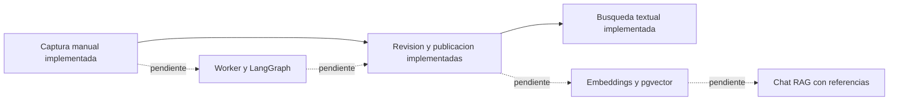

# Plan del producto

[Indice general](../README.md)

Corte: 2026-09-13. Este es un plan inicial basado en las conversaciones y en el
codigo existente; no sustituye una validacion de alcance contigo. Las funciones
nuevas propuestas se identifican como tales. No hay fechas de entrega comprometidas.

- [Requisitos con checklist](requisitos.md): que debe cumplir el producto.
- [Product backlog](product-backlog.md): historias, prioridad y aceptacion.
- [Sprints y tablero](sprints.md): orden de trabajo y criterios de cierre.
- [Bitacora diaria](../bitacora/2026-09-13.md): evidencia de lo realizado.

## Como interpretar el avance

`[x]` significa implementado en codigo dentro del alcance descrito; no significa
desplegado ni listo para produccion. `[ ]` incluye pendientes y avances parciales,
que se explican junto al requisito. Una migracion preparada no equivale a aplicada.
No se asigna un porcentaje global: las tareas tienen tamanos y riesgos diferentes.

El producto ya permite construir conocimiento manualmente. La automatizacion de
esa construccion y las respuestas con IA son el siguiente bloque de desarrollo.

## Acuerdos por validar

- Modelo/proveedor de IA, presupuesto, privacidad y retencion de datos.
- Quienes pueden crear organizaciones y como se invitan otros usuarios.
- Prioridad de voz frente a texto y capturas; limites por organizacion.
- Destino del despliegue, volumen esperado y objetivos de latencia/disponibilidad.

Cada cambio futuro debe actualizar su requisito, historia, ficha de endpoint,
prueba y bitacora cuando corresponda. Este seguimiento es manual.
